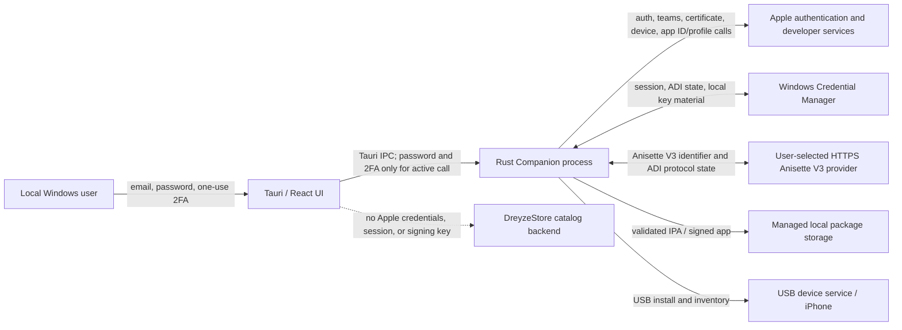

# DreyzeStore Apple provisioning threat model

## Scope and assumptions

This model covers the experimental Windows Companion Apple Account provisioning path introduced in PHASE 8.5. The confirmed threat model is **one local Windows user**. Windows Credential Manager and DPAPI isolate stored material from other ordinary Windows users, but do not defend against malware or an administrator acting as the same logged-in user. Live Apple-service and physical-device behavior remain unverified.

## Data flow and trust boundaries

## Assets

- Apple Account password and one-time verification code in transient UI/process memory.
- Apple session token and ADSID in the current user's Windows Credential Manager.
- Anisette/ADI state and the selected provider URL in local credential storage.
- Locally generated signing private key and Apple Development certificate metadata.
- Original verified package, extracted app, and signed app in managed local storage.
- Device UDID/team registration state and installation inventory.

## Threats and mitigations

| Threat | Mitigations in this phase | Residual risk |
|---|---|---|
| Apple credentials leaked to DreyzeStore backend | Apple auth runs in local Companion; no backend call is present in the auth flow; UI explicitly states boundary | Verify with network capture during real-device test |
| Anisette provider harvests credentials | UI states exactly that the operator is a third party and receives Anisette/ADI data; explicit trust checkbox; endpoint must use HTTPS | Provider sees its protocol payload and can correlate requests; no local provider yet |
| MITM / insecure endpoint | HTTPS required; URL credentials/query/fragment rejected; upstream uses TLS/WSS | A trusted CA compromise or malicious endpoint remains possible |
| Password/code appears in logs | upstream debug output disabled; Companion does not initialize verbose upstream logging; generic Tauri errors; no credential fields in audit/diagnostics | Runtime/crash tooling and OS-level memory access are outside the app's complete control |
| Session theft | Windows Credential Manager; expiry checked before restore; sign-out deletes session/ADSID/account metadata | Malware running as the user can access process/account context; session invalidation remains Apple's responsibility |
| Wrong team/device profile used | explicit team selection; user confirmation before device registration; registration state cleared after account/team changes; signed profile claims checked against team, bundle ID, UDID and expiry | Apple profile signature and runtime entitlement checks remain authoritative |
| Malicious/tampered IPA | existing VerifiedPackage path and second local IPA validation are retained; narrow package envelope; signature/profile inspection before install; exact device inventory confirmation | Integrity and metadata checks do not prove that an app is benign |
| Bundle identifier confusion | deterministic `<original>.<team ID>` ID; signed output metadata must match; profile authorization rechecked | Cross-team migration and extension bundles are not supported |
| Certificate quota bypass / revocation | upstream max-certificate behavior is explicitly `Error`; no automatic certificate deletion/revocation | User may need to manage account limits through Apple-supported tools |
| Replay or duplicate local install action | existing paired local API authentication, timestamp/nonce, and idempotent install job checks remain the installation boundary | Apple auth protocol itself is undocumented and separately controlled by upstream library |
| License obligations missed | dependencies pinned and license metadata recorded; no SideStore/iLoader source is copied | A distributable binary linking the LGPL dependency needs packaging/relinking compliance review before release |

## Security checks and evidence

- Password/2FA do not appear in command-line arguments or persistent app storage.
- Password crosses Tauri IPC only for the local sign-in call; the UI clears its controlled field immediately after starting the call.
- The anisette endpoint must be explicit and HTTPS; the default value alone does not imply trust.
- Auth/session/ADI storage uses Windows Credential Manager through the native keyring backend.
- IPA signing is not a path around normal package validation, local device pairing, signing checks, and inventory confirmation.
- Mock/unit tests can validate state and package policy only. They cannot establish Apple's acceptance or a physical installation.
