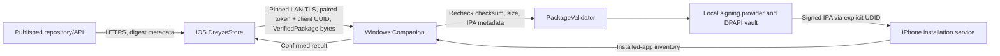

# DreyzeStore Windows Companion Threat Model

Scope: PHASE 6.5's iPhone-to-Windows Companion install path. This is a focused trust-boundary review, not a claim that the complete app package or operating system is safe.

## System and assets

Protected assets: authorized IPA bytes and published SHA-256; pairing token; device UDID and trust state; P12 private key and password; provisioning profile; local TLS private key; install and refresh records. Security boundaries: public store/API vs iPhone; iPhone vs Windows LAN service; Windows user account vs local files/processes; USB trusted pairing vs device installation services.

## Attacker assumptions

The model considers a malicious or compromised LAN client, replayed/stale API requests, a modified or malformed IPA, a fake/changed LAN endpoint, malicious repository metadata, and accidental local credential exposure. It does not assume an attacker already has Windows administrator privileges, can compromise iOS/Windows itself, or control both devices at the same time.

## Threat register

| ID | Threat | Risk | Mitigation in this phase | Remaining exposure |
| --- | --- | --- | --- | --- |
| T1 | LAN client submits an install/uninstall request | High | One-use 120-second pairing code; token hash and paired client UUID in Windows Credential Manager; TLS certificate fingerprint pin; timestamp and unique nonce; pair rate limit | Token theft from a compromised paired phone permits local calls until forgotten/replaced |
| T2 | MITM swaps IPA or Companion endpoint | High | iPhone checks a private HTTPS URL, pins exact certificate DER SHA-256, refuses redirects; Windows independently hashes bytes against package expectation | User must obtain the displayed QR from the intended PC; checksum is integrity, not publisher trust |
| T3 | Replay install request or duplicate job | Medium | Request UUID, create-new staging file, request state dedupe, timestamp window and nonce replay cache | In-memory jobs reset on Companion restart; no remote install result is fabricated after reset |
| T4 | Malformed/hostile archive escapes or exhausts storage | High | Upload size cap; actual byte count; strict ZIP entry/expanded-size/compression-ratio caps; path traversal, absolute path, symlink, Payload, plist and executable checks; extraction to generated directory; orphan cleanup | Native signer/parser bugs remain possible; the app can reject unusual legitimate packages |
| T5 | IPA metadata differs from store metadata | High | Windows compares expected digest, bundle ID, version, build, size, minimum OS; signed output metadata is compared again | A malicious publisher can publish malware with internally matching metadata/hash |
| T6 | Arbitrary path/URL or command injection | High | Local API accepts streamed bytes and typed metadata, no filesystem path or URL; UUID/digest generated storage names; process arguments are passed as an array; validated UDID and bundle ID; no shell | Same-user malware can manipulate app-data/processes |
| T7 | Signing credential leaks to cloud, logs, or process list | High | No Apple login UI/API; DPAPI-encrypted P12/profile; Credential Manager password; zsign password stdin patch and zeroization; no password argv/env | zsign requires a transient P12 file in app data; a crash may leave it until next startup cleanup; deletion is not secure erase |
| T8 | Companion reports install on handoff or tool exit only | High | Confirm installation via connected device inventory and exact bundle/version/build readback; uninstall also checks disappearance | Inventory response behavior must be verified on real supported devices |
| T9 | Refresh reuses a path from corrupted local metadata | Medium | Refuse unless stored name is exactly SHA-256 plus `.ipa`; same paired UDID; verify original package before re-sign/install | Local metadata corruption can make refresh unavailable; it cannot select an arbitrary path |
| T10 | Old profile expires / app stops launching | Medium | Parse profile expiration, block expired profile, show expiration; no permanent-signing promise | User must import refreshed Apple-supported identity/profile and reinstall |

## Security invariants

1. `InstallationBackend` accepts only the iOS `VerifiedPackage` type.
2. Windows recomputes digest and metadata before signing; it does not trust the iPhone's prior verification claim.
3. A server metadata object or URL cannot be converted into a local install path.
4. `Installed` means device inventory readback exactly matches the package identity.
5. Share Sheet/handoff, if available on older iOS versions, remains `Handed Off` and cannot be reported as Installed.
6. Apple credentials/private key material do not enter Cloudflare, repository metadata, CI secrets, or Git.

## Operational assumptions and residual risk

Windows device support depends on the upstream `pymobiledevice3` CLI and classic iTunes' Apple Mobile Device Service; this project does not redistribute the GPL tool. Developer Mode is not reported by the current usbmux short-info output and must be verified manually when unknown. An unsigned installer is not a trusted Windows publisher. zsign and its bundled cryptographic dependencies are pinned and notices are bundled, but a physical iPhone test is still required before claiming the full real-device path is verified.
