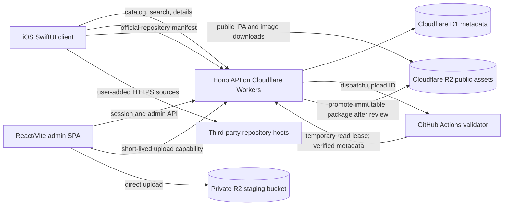

# DreyzeStore architecture

**Status:** Phase 1 foundation. The repository now contains the native app shell, typed Worker health endpoint, schema, local migrations, admin shell, and CI. No cloud resources have been created. This document describes the target architecture; most product routes and workflows remain future-phase work.

## Goals and platform boundary

DreyzeStore is a native SwiftUI catalog and package manager with a separate metadata API, object storage, repository format, and web administration client. It can always browse, cache, download, and verify packages. Installing a verified IPA is conditional on an installation mechanism that the OS and the device actually make available.

An ordinary sandboxed iOS app does not get a general-purpose API to install arbitrary IPA files or enumerate every installed third-party app. The client must therefore report **Downloaded** or **Verified** until an installation backend provides evidence of an installation. It must not turn a successful download, URL handoff, or button tap into **Installed**.

## Proposed monorepo boundaries

```text
ios/DreyzeStore/       Native SwiftUI client
backend/               Hono API Worker, D1 migrations, validation dispatch
admin/                 React + TypeScript + Vite administration SPA
shared/schemas/        Versioned JSON Schema and shared contract fixtures
scripts/               Local setup, schema and release tooling
docs/                  Architecture, operations, security, and format docs
.github/workflows/     CI and isolated package validation jobs
```

The admin app is a static SPA because it has no public pages that need server-side rendering. The API remains the only authority for accounts, permissions, metadata, and release state. This avoids adding a second application server for the admin panel.

## System shape



The public package bucket contains only published releases. A separate private R2 bucket holds pending uploads. R2 presigned URLs are short-lived bearer capabilities, limited to one object and one operation; the app bundle, admin JavaScript, logs, and API responses must never contain R2 credentials.

### Upload and publication state

```text
created -> uploading -> queued -> validating -> validated -> published
                                      |                |
                                      +-> rejected     +-> rejected by admin
```

1. An authenticated admin creates a draft and requests an upload ticket.
2. The browser sends the bytes directly to a private staging object using temporary upload URLs. Large uploads use R2 multipart operations.
3. The API dispatches an upload ID, not the IPA or a bearer URL, to a trusted workflow on the default branch.
4. An isolated standard Linux runner fetches the staged object through a short-lived, read-only lease. It computes SHA-256, inspects ZIP entries and IPA metadata, and emits a bounded metadata report. It never executes IPA contents or receives signing keys.
5. A separate, minimal reporting job obtains a GitHub OIDC token. The Worker accepts the report only when the token's issuer, audience, repository, workflow identity, and protected ref match the configured validator. The parser job has no cloud credential or OIDC permission.
6. The API compares the report with the admin's intended app and creates a **validated draft release**. The admin reviews bundle ID, version, size, and checksum before publishing.
7. On publish, the Worker copies the immutable staged object to the public R2 bucket, inserts release metadata, and records an audit event. Rejected, expired, and abandoned stage objects are removed by lifecycle cleanup.

This keeps large-file transfer and archive parsing outside the Workers Free request path. GitHub documents standard hosted runner use as free for public repositories; private repositories draw against an account allowance and can incur charges after it is exhausted. The design assumes the open-source repository is public and standard Linux runners are used. If that assumption changes, the validator must pause when free capacity is unavailable; it must not enable billing or switch to larger runners automatically. See [GitHub Actions billing](https://docs.github.com/en/billing/concepts/product-billing/github-actions) and [GitHub OIDC](https://docs.github.com/en/actions/concepts/security/openid-connect).

## Cloud architecture

| Concern | Decision | Boundary |
|---|---|---|
| API | TypeScript + Hono on Cloudflare Workers | Stateless routes; environment bindings for D1/R2; never trusts client-supplied package metadata |
| Metadata | Cloudflare D1 | SQLite-compatible relational metadata, migrations, indexes, sessions, audit records |
| Packages and media | Cloudflare R2 | Separate private staging and public immutable release/assets buckets |
| Admin | React + TypeScript + Vite SPA | Static UI; secure session and every permission check live in the API |
| Package validation | GitHub Actions standard Ubuntu runner for a public repository | No IPA in Git, workflow artifacts, or logs; no IPA code execution |
| CDN | R2 custom domain for published, public objects | HTTPS; URLs are generated from server-controlled object keys |
| Local development | Wrangler local D1/R2 bindings and local admin/client configuration | No Cloudflare account, domain, or production data required |

This keeps the requested Workers/Hono/D1/R2 architecture. It adds GitHub Actions only for the workload the current Workers Free CPU limit is unsuitable for. Cloudflare documents 10 ms CPU per Free Worker invocation and a 100 MB maximum incoming request body on its Free account plan; large uploads are sent directly to R2, and archive parsing/hash work runs in the validator instead. [Workers limits](https://developers.cloudflare.com/workers/platform/limits/)

Cloudflare's current R2 Free allowance is 10 GB-month storage, 1 million Class A operations, and 10 million Class B operations per month, with no egress charge. Usage beyond included allowances is billable. Workers Paid has a $5/month minimum. Phase 0 provisions nothing; later deployment must stay within free allowances or stop before activating paid services. [R2 pricing](https://developers.cloudflare.com/r2/pricing/), [Workers pricing](https://developers.cloudflare.com/workers/platform/pricing/)

Production hostnames are `api.<owned-domain>`, `admin.<owned-domain>`, and `cdn.<owned-domain>`. Development uses local Worker URLs. No domain, DNS record, account, secret, or production service is created as part of this phase.

## REST API contract

Base path: `/api/v1`. JSON uses UTF-8 and camelCase fields. IDs are opaque and stable. Public APIs return only published records and never expose R2 object keys, admin fields, or storage credentials.

Success envelope:

```json
{
  "data": {},
  "meta": { "requestId": "req_...", "nextCursor": null }
}
```

Error envelope:

```json
{
  "error": {
    "code": "invalid_query",
    "message": "The search query is invalid.",
    "requestId": "req_..."
  }
}
```

Do not include stack traces, passwords, cookies, presigned URLs, or raw tokens in errors. `details` may carry field-level validation messages. Cacheable public responses use ETag/conditional requests; authenticated admin responses use `Cache-Control: no-store`.

| Route | Contract |
|---|---|
| `GET /apps?category=&repository=&sort=&cursor=&limit=` | Published app page. `sort` is `popular`, `newest`, or `updated`; opaque cursor, default page size 24, maximum 100. |
| `GET /apps/:id` | App detail including developer, repository, current release, screenshots, and release summary. |
| `GET /apps/:id/versions?cursor=&limit=` | Published release history, newest semantic version first. |
| `GET /categories` | Stable category IDs, display names, and published counts. |
| `GET /featured` | Editorial sections and referenced app IDs; no presentation data is hardcoded in the client. |
| `GET /search?q=&cursor=&limit=` | Server search across app name, developer, bundle ID, description, and category. Query length is bounded. |
| `GET /updates?cursor=&limit=` | Latest published releases, suitable for local comparison with a list the client already knows. It does not discover installed apps. |
| `GET /repository` | Official repository manifest, validated against repository format v1. |
| `GET /apps/:id/versions/:versionId/download` | Published-package redirect or stream with correct content type, length, ETag, and byte-range support where the origin permits it. |
| `POST /admin/session`, `DELETE /admin/session` | OAuth callback/session lifecycle; session cookie is server-owned. |
| `POST /admin/apps`, `PATCH /admin/apps/:id`, `DELETE /admin/apps/:id` | Create/edit/unpublish an app. Delete is a soft delete; release objects and audit history are not erased implicitly. |
| `POST /admin/upload`, `POST /admin/upload/:id/complete` | Create an upload ticket and signal upload completion for asynchronous validation. |
| `POST /admin/apps/:id/releases` | Create a release only from a validated upload ID; publish state requires explicit admin action. |
| `POST /admin/apps/:id/versions/:versionId/publish` | Publish a reviewed, validated draft release. |
| `POST /admin/featured` | Replace or update ordered editorial sections after validating app references. |

`POST`, `PATCH`, and `DELETE` require an authenticated role, exact allowed `Origin`, CSRF token, and request-size limits. Statuses include `200`, `201`, `202`, `204`, `400`, `401`, `403`, `404`, `409`, `413`, `415`, `422`, `429`, and `500` as appropriate. All API handlers validate path/query/body input before data access.

Version comparison uses semantic components and prerelease ordering, never string comparison: `1.0 < 1.1`, `1.9 < 1.10`, and `2.0-beta < 2.0`. Preserve the original version/build strings for display. For legacy two-component versions, compare the missing patch component as zero. A release's bundle identifier must match the app record and its `Info.plist`.

## D1 data model

Initial normalized tables and constraints:

| Table | Purpose and important indexes |
|---|---|
| `developers` | Display name and optional public links; unique stable ID. |
| `categories` | Stable slug and localized display name; unique slug. |
| `apps` | UUID, bundle ID, developer/category foreign keys, text/media fields, publication/deletion timestamps; indexes on `published`, category, developer, and updated time. |
| `versions` | App FK, version/build, minimum OS, immutable R2 object key, SHA-256, byte size, release notes, validation/publication state, uploader/time, distribution-rights attestation and evidence URL; unique `(app_id, version, build)` and index `(app_id, published_at)`. |
| `screenshots` | App FK, R2 asset key/URL, order, accessibility caption; index `(app_id, ordinal)`. |
| `featured` | Section key, app FK, rank, date window; index `(section_key, rank)`. |
| `app_daily_downloads` | Daily aggregate of download-link requests for popularity sorting; index `(app_id, day)`. This counts requested downloads, not completed installations. |
| `repositories` | Identifier, manifest URL, trust/health metadata and added/updated times; unique identifier and URL hash. |
| `admin_users` | External identity subject, role, enabled state, creation/last-auth times; unique `(provider, subject)`. No plaintext password field. |
| `admin_sessions` | Hash of random opaque session token, user FK, CSRF-token hash, expiry/revocation; unique token hash. |
| `audit_logs` | Actor FK/snapshot, action, resource type/id, timestamp, request ID, pseudonymous IP metadata; indexed by time and resource. Never stores auth secrets. |
| `upload_jobs` | Upload UUID, private R2 staging key, state, expected app, validator workflow/run ID, expiry, validation summary. |
| `rate_limit_buckets` | Short-lived keyed counters for admin login/API abuse controls; keyed by a keyed hash, not raw IP. |

Use foreign keys where supported, explicit SQL migrations, prepared statements, stable IDs, bounded text fields, and indexes for every public list/search path. Do not persist binaries or large screenshots in D1. Keep app DTOs separate from database row types.

## iOS client structure

Proposed deployment target: **iOS 16.0**. Gate MarketplaceKit behind its runtime and entitlement requirements. Use Swift, SwiftUI, async/await, Codable, URLSession, and system frameworks. The normal app UI is native; no WebView is used for catalog screens.

```text
App/                 App entry, dependency container, tab shell
Core/                shared configuration, identifiers, concurrency helpers
Networking/          APIClient, request/response envelopes, typed errors
Models/              StoreApp, AppVersion, Developer, Category, Screenshot
Services/            AppService, SearchService, UpdateService, DeviceCapabilityService
Repositories/        store API, repository validation, local metadata snapshots
Features/             Today, Apps, Search, Details, Updates, Library, Settings,
                      Sources, Onboarding
Components/           cards, image loader, skeleton, download control, galleries
Installation/         protocol, backend registry, OS-supported adapters, TrollStore handoff
Downloads/            background URLSession, task persistence, retry/cancel/cleanup
Security/             SHA-256, archive validation, source trust and URL policy
Persistence/          bounded catalog/download history and local preferences
Utilities/            semantic version comparison, formatting, accessibility/haptics
```

The current Xcode target is an iOS 16.0 SwiftUI app shell. Its five tab screens explicitly state that catalog features are not yet available; no sample app listing is bundled. The code has typed models, an API client, a repository contract, and a semantic-version utility. Download and package verification implementations are deferred to later phases.

The backend currently implements only `GET /api/v1/health`. API response DTOs are in `shared/src/contracts.ts`; unimplemented product routes intentionally return `404`. The admin page only performs a real health check and has no login or write controls until their implementation phases.

The tab shell is Today, Apps, Search, Updates, and Library. Features use lazy lists, task cancellation, Dynamic Type, VoiceOver labels, Reduce Motion, dark mode, explicit loading/empty/offline/error states, and no color-only status meaning.

## Repository contract

Repository v1 is specified in [repository-format.md](repository-format.md) and `shared/schemas/repository-v1.schema.json`. V1 uses strict unknown-field rejection, HTTPS URLs, bounded collections, UTC RFC 3339 dates, non-empty release lists, byte sizes, and lowercase 64-character SHA-256 digests. Shape validation is followed by semantic checks for duplicate bundle IDs and release pairs.

The app fetches third-party repositories directly from their HTTPS origin rather than making the backend proxy arbitrary user URLs. The add-source flow explains trust implications before the source is stored. Repository-provided descriptions and screenshots are untrusted display content.

## Licenses reviewed

The DreyzeStore source license is MIT. This license applies to DreyzeStore code, not to IPA files or media uploaded by repository maintainers; catalog releases require an explicit distribution-rights record from the publisher.

| Component | Upstream license / decision |
|---|---|
| TrollStore upstream | Its repository identifies most files as MIT and `RootHelper/uicache.m` as BSD-4-Clause. No TrollStore code is copied or linked. Preserve both notices and the CoolStar advertising acknowledgment if a future reviewed integration ever vendors that file. |
| TrollStore Lite | It is a build target in `opa334/TrollStore`, not a separately documented DreyzeStore SDK. It uses the shared TrollStore source with `TROLLSTORE_LITE`; it is not integrated. |
| Hono | MIT; direct API dependency in Phase 1. |
| React and Vite | MIT; direct admin dependencies in Phase 1. |
| Wrangler and `@cloudflare/workers-types` | MIT OR Apache-2.0; used for local Worker tooling and types. |
| Ajv and `ajv-formats` | MIT; used for strict shared repository-schema validation. |
| TypeScript | Apache-2.0; compiler and type checker. |
| ZIPFoundation | MIT; candidate for safe IPA ZIP inspection on iOS, subject to Phase 1 dependency review and tests against path traversal/size-limit behavior before use. |
| Cloudflare Workers, D1, R2 | Hosted services, not vendored libraries. Their plans/terms and quotas remain separate from the open-source code license. |

Upstream references: [TrollStore license](https://github.com/opa334/TrollStore/blob/main/LICENSE), [TrollStore Lite build target](https://github.com/opa334/TrollStore/blob/main/TrollStoreLite/Makefile), [Hono license](https://github.com/honojs/hono/blob/main/LICENSE), [React license](https://github.com/facebook/react/blob/main/LICENSE), [Vite license](https://github.com/vitejs/vite/blob/main/LICENSE), and [ZIPFoundation license](https://github.com/weichsel/ZIPFoundation/blob/master/LICENSE).

## Phase gates

Phase 1 established the repository layout, project shells, shared schemas, local migrations, Worker health route, CI, and documentation without production app data or cloud provisioning. Later phases can implement catalog API/UI, validation, and authenticated publishing locally. Production DNS, Cloudflare accounts/resources/secrets, paid capacity, and app-distribution entitlements remain explicit deployment decisions after review.
