# Windows Companion Security

## Boundaries

```mermaid
flowchart LR
  Store[Published catalog and IPA] -->|HTTPS download, published SHA-256| Phone[iPhone DreyzeStore]
  Phone -->|VerifiedPackage over pinned local TLS| Companion[Windows Companion]
  Companion -->|SHA-256 and IPA metadata recheck| Validator[Bounded archive validator]
  Validator -->|ValidatedPackage| Signer[Local zsign + local identity]
  Signer -->|Signed IPA| USB[Apple Mobile Device Service / usbmux]
  USB -->|Install request| iPhone
  USB -->|Apps inventory readback| Companion
  Companion -->|Exact installed bundle, version, build| Phone
```

The cloud catalog supplies metadata and published files only. The Apple account password, 2FA code, private key material, provisioning profile, device pairing record, and local Companion token do not cross that boundary.

## Threats and controls

| Threat | Controls | Residual limit |
| --- | --- | --- |
| Malicious LAN client | Bind to one private interface; one-use short-lived pairing code; random token bound to the iPhone's paired client UUID; timestamp and one-use nonce; rate limit pairing | A LAN attacker can deny service or disrupt the connection |
| MITM / fake companion | Self-signed TLS plus exact certificate SHA-256 pin in the user-scanned QR; iOS rejects redirects | The QR must be obtained from the intended computer over a trusted physical/local interaction |
| Replayed request | Unique request ID; fresh timestamp; nonce replay cache; one-use install job ID | A companion restart clears in-memory job state; pairing token remains until user forgets/re-pairs |
| Modified IPA or false phone claim | Windows recomputes the package digest, size, ZIP structure, bundle ID, version, build, and minimum OS before signing; device inventory is queried after install | SHA-256 authenticates published integrity, not app safety or publisher identity |
| ZIP traversal, symlink, or archive bomb | Entry count, per-entry and aggregate expanded-size, compression-ratio, path-component, and symlink checks; extraction only from a fresh generated workspace | The iOS app or signing tool can still reject edge-case App Store package constructs |
| Arbitrary filesystem path / URL | Install API accepts streamed bytes only; server-generated UUID and digest names; fixed command argument arrays, no shell | Local administrator malware can tamper with files/processes as the same Windows user |
| Command injection | Device identifiers, bundle IDs, and paths are validated; `tokio::process::Command` uses separated arguments; no shell interpolation | The external Python/service installation remains a local host dependency |
| Pairing token theft | Token only in iOS Keychain; Windows stores only token hash in Credential Manager; TLS pinning; Forget revokes token | A compromised iPhone or Windows user account can access that endpoint locally |
| Signing secret at rest | P12/profile encrypted with Windows DPAPI; P12 password in Windows Credential Manager; sensitive password is sent to zsign only through a length-prefixed stdin pipe and zeroized | zsign requires a short-lived clear P12 file in the user-only app-data workspace; normal completion removes it and next startup clears interrupted signer workspaces; SSD deletion is not secure erasure |
| Credential/log leakage | Apple password and 2FA are never collected; passwords are omitted from process arguments/environment; install history stores no credentials | Device-service diagnostics may include non-secret device metadata |
| Trust mistaken for successful install | `Installed` requires companion job success plus inventory readback matching bundle ID, version, and build; external handoff remains a different result | Physical iPhone behavior has not yet been tested in this environment |

## Sensitive data lifecycle

- Local pair token: iOS Keychain, `AfterFirstUnlockThisDeviceOnly`; Windows Credential Manager stores its digest and paired client UUID. Forget on Windows revokes the host token; clear the stale iOS pairing in DreyzeStore Settings before pairing again.
- Signing P12 and `.mobileprovision`: encrypted with DPAPI in Companion app data.
- P12 password: Windows Credential Manager; short-lived zeroized Rust value; length-prefixed stdin to the local signer, never an argument or environment variable.
- Clear signer input: written temporarily for zsign, then deleted by scope cleanup. An abrupt process termination can leave app-data files; startup cleanup deletes UUID-scoped signing workspaces.
- Package originals: retained only after a real inventory-confirmed install to support local same-version refresh; named by SHA-256. Uninstall removes the saved original after device inventory confirms the app is gone.
- Failed/partial transfers and signed outputs: deleted on failure or at next app startup.

## Package verification claim

A checksum match proves the downloaded bytes match the digest published for that release. It does not prove that the application is benign, authorized, compatible, or legally distributable. DreyzeStore iOS and Companion both validate package bytes and metadata; neither treats the repository as inherently trusted.
